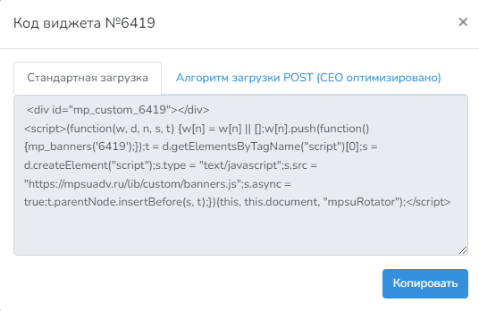

# Какой код устанавливать?

В админ-панели, при заходе на главную страницу можете наблюдать свои виджеты и правее от них кнопку "Получить код". При переходе по кнопке - всплывает окно с выбором кода для этого виджета. Появилась возможность выбирать какой код загружать на свой сайт.

1. Стандартная загрузка код
2. Алгоритм загрузки POST

* 

**В чём преимущества POST?**

Более привлекательные показатели при загрузке сайта для поисковых систем, что положительно сказывается на позициях в выдаче в долгосрочной перспективе, а так же положительно скажется на доходе. Страницы с размещенным оптимизированным кодом грузятся быстрее, в отличии от кодов РСЯ.&#x20;

_**Важно:** На 1 сайте одновременно может размещаться только один тип кода. Если стоит 3 виджета - необходимо заменить коды всех трёх виджетов!_

